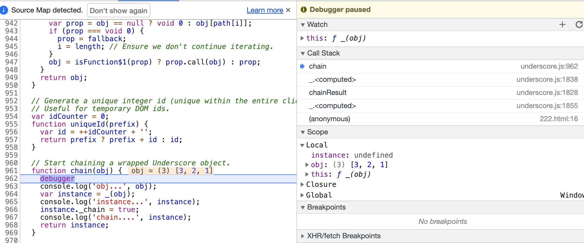

each(['pop', 'push', 'reverse', 'shift', 'sort', 'splice', 'unshift'], 

each(['concat', 'join', 'slice']


3年前

https://www.npmjs.com/package/underscore

npm i underscore@1.9.0 -D

npm uninstall underscore 


#### 若川

https://lxchuan12.gitee.io/underscore/#_5-3-underscore-js-%E7%A9%B6%E7%AB%9F%E5%9C%A8-%E5%92%8C-prototype%E6%8C%82%E8%BD%BD%E4%BA%86%E5%A4%9A%E5%B0%91%E6%96%B9%E6%B3%95%E5%92%8C%E5%B1%9E%E6%80%A7


1. [吴晓军源码分析系列](https://www.gitbook.com/book/yoyoyohamapi/undersercore-analysis/details) (失效了)
2. [韩子迟源码分析系列](https://github.com/hanzichi/underscore-analysis)

### **chain**

**chain**`_.chain(obj)`
返回一个封装的对象. 在封装的对象上调用方法会返回封装的对象本身, 直道 `value` 方法调用为止。

```js
var stooges = [{name: 'curly', age: 25}, {name: 'moe', age: 21}, {name: 'larry', age: 23}];
var youngest = _.chain(stooges)
  .sortBy(function(stooge){ return stooge.age; })
  .map(function(stooge){ return stooge.name + ' is ' + stooge.age; })
  .first()
  .value();
=> "moe is 21"
```

### each

集合函数 (数组 或对象)

**each**`_.each(list, iteratee, [context])` *Alias: **forEach***
遍历**list**中的所有元素，按顺序用每个元素当做参数调用 **iteratee** 函数。如果传递了**context**参数，则把**iteratee**绑定到**context**对象上。每次调用**iteratee**都会传递三个参数：`(element, index, list)`。如果**list**是个JavaScript对象，**iteratee**的参数是 `(value, key, list)`)。返回**list**以方便链式调用。

```js
_.each([1, 2, 3], alert);
=> alerts each number in turn...
_.each({one: 1, two: 2, three: 3}, alert);
=> alerts each number value in turn...
```

### **map**

**map**`_.map(list, iteratee, [context])` *Alias: **collect***
通过对 **list** 里的每个元素调用转换函数([**iteratee**](https://underscorejs.net/#iteratee)迭代器)生成一个与之相对应的数组。`iteratee`传递三个参数：`value`，然后是迭代 `index`(或 `key` 愚人码头注：如果**list**是个JavaScript对象是，这个参数就是`key`)，最后一个是引用指向整个`list`。

```js
_.map([1, 2, 3], function(num){ return num * 3; });
=> [3, 6, 9]
_.map({one: 1, two: 2, three: 3}, function(num, key){ return num * 3; });
=> [3, 6, 9]
_.map([[1, 2], [3, 4]], _.first);
=> [1, 3]
```


# 1、如何写自己的 underscore

## 前言

在 [《JavaScript 专题系列》](https://github.com/mqyqingfeng/Blog/issues/53) 中，我们写了很多的功能函数，比如防抖、节流、去重、类型判断、扁平数组、深浅拷贝、查找数组元素、通用遍历、柯里化、函数组合、函数记忆、乱序等，可以我们该如何组织这些函数，形成自己的一个工具函数库呢？这个时候，我们就要借鉴 underscore 是怎么做的了。

## 自己实现

如果是我们自己去组织这些函数，我们该怎么做呢？我想我会这样做：

```
(function(){
    var root = this;

    var _ = {};

    root._ = _;

    // 在这里添加自己的方法
    _.reverse = function(string){
        return string.split('').reverse().join('');
    }

})()

_.reverse('hello');
=> 'olleh'
```

我们将所有的方法添加到一个名为 `_` 的对象上，然后将该对象挂载到全局对象上。

之所以不直接 `window._ = _` 是因为我们写的是一个工具函数库，不仅要求可以运行在浏览器端，还可以运行在诸如 Node 等环境中。

## root

然而 underscore 可不会写得如此简单，我们从 `var root = this` 开始说起。

之所以写这一句，是因为我们要通过 this 获得全局对象，然后将 `_` 对象，挂载上去。

然而在严格模式下，this 返回 undefined，而不是指向 Window，幸运的是 underscore 并没有采用严格模式，可是即便如此，也不能避免，因为在 ES6 中模块脚本自动采用严格模式，不管有没有声明 `use strict`。

如果 this 返回 undefined，代码就会报错，所以我们的思路是对环境进行检测，然后挂载到正确的对象上。我们修改一下代码：

```js
var root = (typeof window == 'object' && window.window == window && window) ||
           (typeof global == 'object' && global.global == global && global);
```

在这段代码中，我们判断了浏览器和 Node 环境，可是只有这两个环境吗？那我们来看看 Web Worker。

## Web Worker

Web Worker 属于 HTML5 中的内容，引用《JavaScript权威指南》中的话就是：

> 在 Web Worker 标准中，定义了解决客户端 JavaScript 无法多线程的问题。其中定义的 “worker” 是指执行代码的并行过程。不过，Web Worker 处在一个自包含的执行环境中，无法访问 Window 对象和 Document 对象，和主线程之间的通信业只能通过异步消息传递机制来实现。

为了演示 Web Worker 的效果，我写了一个 demo，[查看代码](https://github.com/mqyqingfeng/Blog/tree/master/demos/web-worker)。

在 Web Worker 中，是无法访问 Window 对象的，所以 `typeof window` 和 `typeof global` 的结果都是 `undefined`，所以最终 root 的值为 false，将一个基本类型的值像对象一样添加属性和方法，自然是会报错的。

那么我们该怎么办呢？

虽然在 Web Worker 中不能访问到 Window 对象，但是我们却能通过 self 访问到 Worker 环境中的全局对象。我们只是要找全局变量挂载而已，所以完全可以挂到 self 中嘛。

而且在浏览器中，除了 window 属性，我们也可以通过 self 属性直接访问到 Winow 对象。

```
console.log(window.window === window); // true
console.log(window.self === window); // true
```

考虑到使用 self 还可以额外支持 Web Worker，我们直接将代码改成 self：

```
var root = (typeof self == 'object' && self.self == self && self) ||
           (typeof global == 'object' && global.global == global && global);
```

## node vm

到了这里，依然没完，让你想不到的是，在 node 的 vm 模块中，也就是沙盒模块，runInContext 方法中，是不存在 window，也不存在 global 变量的，[查看代码](https://github.com/mqyqingfeng/Blog/blob/master/demos/node-vm/index.js)。

但是我们却可以通过 this 访问到全局对象，所以就有人发起了一个 PR，代码改成了：

```
var root = (typeof self == 'object' && self.self == self && self) ||
           (typeof global == 'object' && global.global == global && global) ||
           this;
```

## 微信小程序

到了这里，还是没完，轮到微信小程序登场了。

因为在微信小程序中，window 和 global 都是 undefined，加上又强制使用严格模式，this 为 undefined，挂载就会发生错误，所以就有人又发了一个 PR，代码变成了：

```
var root = (typeof self == 'object' && self.self == self && self) ||
           (typeof global == 'object' && global.global == global && global) ||
           this ||
           {};
```

这就是现在 v1.8.3 的样子。

虽然作者可以直接讲解最终的代码，但是作者更希望带着大家看看这看似普通的代码是如何一步步演变成这样的，也希望告诉大家，代码的健壮性，并非一蹴而就，而是汇集了很多人的经验，考虑到了很多我们意想不到的地方，这也是开源项目的好处吧。

## 函数对象

现在我们讲第二句 `var _ = {};`。

如果仅仅设置 _ 为一个空对象，我们调用方法的时候，只能使用 `_.reverse('hello')` 的方式，实际上，underscore 也支持类似面向对象的方式调用，即：

```
_('hello').reverse(); // 'olleh'
```

再举个例子比较下两种调用方式：

```js
// 函数式风格
_.each([1, 2, 3], function(item){
    console.log(item)
});

// 面向对象风格
_([1, 2, 3]).each(function(item){
    console.log(item)
});
```

可是该如何实现呢？

既然以 `_([1, 2, 3])` 的形式可以执行，就表明 `_` 不是一个字面量对象，而是一个函数！

幸运的是，在 JavaScript 中，函数也是一种对象，我们举个例子：

```
var _ = function() {};
_.value = 1;
_.log = function() { return this.value + 1 };

console.log(_.value); // 1
console.log(_.log()); // 2
```

我们完全可以将自定义的函数定义在 `_` 函数上！

目前的写法为：

```js
var root = (typeof self == 'object' && self.self == self && self) ||
           (typeof global == 'object' && global.global == global && global) ||
           this ||
           {};

var _ = function() {}

root._ = _;
```

如何做到 `_([1, 2, 3]).each(...)`呢？即 _ 函数返回一个对象，这个对象，如何调用挂在 _ 函数上的方法呢？

我们看看 underscore 是如何实现的：

```
var _ = function(obj) {
    if (!(this instanceof _)) return new _(obj);
    this._wrapped = obj;
};

_([1, 2, 3]);
```

我们分析下 `_([1, 2, 3])` 的执行过程：

1. 执行 `this instanceof _`，this 指向 window ，`window instanceof _` 为 false，`!`操作符取反，所以执行 `new _(obj)`。
2. `new _(obj)` 中，this 指向实例对象，`this instanceof _` 为 true，取反后，代码接着执行
3. 执行 `this._wrapped = obj`， 函数执行结束
4. 总结，`_([1, 2, 3])` 返回一个对象，为 `{_wrapped: [1, 2, 3]}`，该对象的原型指向 _.prototype

示意图如下：

[](https://raw.githubusercontent.com/mqyqingfeng/Blog/master/Images/underscore/new-obj.png)

然后问题来了，我们是将方法挂载到 _ 函数对象上，并没有挂到函数的原型上呐，所以返回了的实例，其实是无法调用 _ 函数对象上的方法的！

我们写个例子：

```
(function(){
    var root = (typeof self == 'object' && self.self == self && self) ||
               (typeof global == 'object' && global.global == global && global) ||
               this ||
               {};

    var _ = function(obj) {
        if (!(this instanceof _)) return new _(obj);
        this._wrapped = obj;
    }

    root._ = _;

    _.log = function(){
        console.log(1)
    }

})()

_().log(); // _(...).log is not a function
```

确实有这个问题，所以我们还需要一个方法将 _ 上的方法复制到 `_.prototype` 上，这个方法就是 `_.mixin`。

## _.functions

为了将 _ 上的方法复制到原型上，首先我们要获得 _ 上的方法，所以我们先写个 `_.functions` 方法。

```
_.functions = function(obj) {
    var names = [];
    for (var key in obj) {
        if (_.isFunction(obj[key])) names.push(key);
    }
    return names.sort();
};
```

isFunction 函数可以参考 [《JavaScript专题之类型判断(下)》](https://github.com/mqyqingfeng/Blog/issues/28)

## ❤❤ mixin

现在我们可以写 mixin 方法了。

```js
var ArrayProto = Array.prototype;
var push = ArrayProto.push;

_.mixin = function(obj) {
    _.each(_.functions(obj), function(name) {
        var func = _[name] = obj[name];
        _.prototype[name] = function() {
          // 为啥要有这行代码，因为所有的函数函数要操作的就是这个对象的_wrapped值。
            var args = [this._wrapped];
           //每个方法传入的参数 arguments
            push.apply(args, arguments);
            return func.apply(_, args);
        };
    });
    return _;
};

_.mixin(_);
```

each 方法可以参考 [《JavaScript专题jQuery通用遍历方法each的实现》](https://github.com/mqyqingfeng/Blog/issues/40)

值得注意的是：因为 `_[name] = obj[name]` 的缘故，我们可以给 underscore 拓展自定义的方法:

```js
_.mixin({
  addOne: function(num) {
    return num + 1;
  }
});

_(2).addOne(); // 3

 var addOneResult = _(2).chain().addOne(); // 3
 console.log('addOneResult', addOneResult);
```

练习

```js
_.mixin({
  addOne: function(num) {
    console.log(num + 1);
    return [1,2,3]
  }
});
var addOneResult = _(2).chain().addOne(); // 打印3 返回[1,2,3]
console.log('addOneResult', addOneResult); // {_wrapped: Array(3), _chain: true}
console.log('addOneResult.push(666', addOneResult.myPush(666)) // 打印 {_wrapped: 4, _chain: true}
```

```js
(function (global, factory) {
  typeof exports === 'object' && typeof module !== 'undefined' ? module.exports = factory() :
  typeof define === 'function' && define.amd ? define('underscore', factory) :
  (global = global || self, (function () {
    var current = global._;
    var exports = global._ = factory();
    exports.noConflict = function () { global._ = current; return exports; };
  }()));
}(this, (function () {
  function myPush (array, item) {
    array.push(item)
    return array.length;
  }
  var allExports = {
    chunk: chunk,
    mixin: mixin,
    myPush: myPush,
  }
	var _$1 = mixin(allExports);
  // Legacy Node.js API.
  _$1._ = _$1;

  return _$1;

})));
```


至此，我们算是实现了同时支持面向对象风格和函数风格。

## 导出

终于到了讲最后一步 `root._ = _`，我们直接看源码：

```
if (typeof exports != 'undefined' && !exports.nodeType) {
    if (typeof module != 'undefined' && !module.nodeType && module.exports) {
        exports = module.exports = _;
    }
    exports._ = _;
} else {
    root._ = _;
}
```

为了支持模块化，我们需要将 _ 在合适的环境中作为模块导出，但是 nodejs 模块的 API 曾经发生过改变，比如在早期版本中：

```
// add.js
exports.addOne = function(num) {
  return num + 1
}

// index.js
var add = require('./add');
add.addOne(2);
```

在新版本中：

```
// add.js
module.exports = function(1){
    return num + 1
}

// index.js
var addOne = require('./add.js')
addOne(2)
```

所以我们根据 exports 和 module 是否存在来选择不同的导出方式，那为什么在新版本中，我们还要使用 `exports = module.exports = _` 呢？

这是因为在 nodejs 中，exports 是 module.exports 的一个引用，当你使用了 module.exports = function(){}，实际上覆盖了 module.exports，但是 exports 并未发生改变，为了避免后面再修改 exports 而导致不能正确输出，就写成这样，将两者保持统一。

写个 demo 吧：

```js
// exports 是 module.exports 的一个引用
module.exports.num = '1'

console.log(exports.num) // 1

exports.num = '2'

console.log(module.exports.num) // 2
// addOne.js
module.exports = function(num){
    return num + 1
}

exports.num = '3'

// result.js 中引入 addOne.js
var addOne = require('./addOne.js');

console.log(addOne(1)) // 2
console.log(addOne.num) // undefined
// addOne.js
exports = module.exports = function(num){
    return num + 1
}

exports.num = '3'

// result.js 中引入 addOne.js
var addOne = require('./addOne.js');

console.log(addOne(1)) // 2
console.log(addOne.num) // 3
```

最后为什么要进行一个 exports.nodeType 判断呢？这是因为如果你在 HTML 页面中加入一个 id 为 exports 的元素，比如

```
<div id="exports"></div>
```

就会生成一个 window.exports 全局变量，你可以直接在浏览器命令行中打印该变量。

此时在浏览器中，`typeof exports != 'undefined'` 的判断就会生效，然后 `exports._ = _`，然而在浏览器中，我们需要将 _ 挂载到全局变量上呐，所以在这里，我们还需要进行一个是否是 DOM 节点的判断。

## 源码

最终的代码如下，有了这个基本结构，你可以自由添加你需要使用到的函数了：

```js
(function() {

    var root = (typeof self == 'object' && self.self == self && self) ||
        (typeof global == 'object' && global.global == global && global) ||
        this || {};

    var ArrayProto = Array.prototype;

    var push = ArrayProto.push;

    var _ = function(obj) {
        if (obj instanceof _) return obj;
        if (!(this instanceof _)) return new _(obj);
        this._wrapped = obj;
    };

    if (typeof exports != 'undefined' && !exports.nodeType) {
        if (typeof module != 'undefined' && !module.nodeType && module.exports) {
            exports = module.exports = _;
        }
        exports._ = _;
    } else {
        root._ = _;
    }

    _.VERSION = '0.1';

    var MAX_ARRAY_INDEX = Math.pow(2, 53) - 1;

    var isArrayLike = function(collection) {
        var length = collection.length;
        return typeof length == 'number' && length >= 0 && length <= MAX_ARRAY_INDEX;
    };

    _.each = function(obj, callback) {
        var length, i = 0;

        if (isArrayLike(obj)) {
            length = obj.length;
            for (; i < length; i++) {
                if (callback.call(obj[i], obj[i], i) === false) {
                    break;
                }
            }
        } else {
            for (i in obj) {
                if (callback.call(obj[i], obj[i], i) === false) {
                    break;
                }
            }
        }

        return obj;
    }

    _.isFunction = function(obj) {
        return typeof obj == 'function' || false;
    };

    _.functions = function(obj) {
        var names = [];
        for (var key in obj) {
            if (_.isFunction(obj[key])) names.push(key);
        }
        return names.sort();
    };

    /**
     * 在 _.mixin(_) 前添加自己定义的方法
     */
    _.reverse = function(string){
        return string.split('').reverse().join('');
    }

    _.mixin = function(obj) {
        _.each(_.functions(obj), function(name) {
            var func = _[name] = obj[name];
            _.prototype[name] = function() {
                var args = [this._wrapped];

                push.apply(args, arguments);

                return func.apply(_, args);
            };
        });
        return _;
    };

    _.mixin(_);

})()
```

## 相关链接

1. [《JavaScript专题之类型判断(下)》](https://github.com/mqyqingfeng/Blog/issues/28)
2. [《JavaScript专题jQuery通用遍历方法each的实现》](https://github.com/mqyqingfeng/Blog/issues/40)


# 2.链式调用

## 前言

本文接着上篇[《underscore 系列之如何写自己的 underscore》](https://github.com/mqyqingfeng/Blog/issues/56)，阅读本篇前，希望你已经阅读了上一篇。

## jQuery

我们都知道 jQuery 可以链式调用，比如：

```
$("div").eq(0).css("width", "200px").show();
```

我们写个简单的 demo 模拟链式调用：

```
function JQuery(selector) {
    this.elements = [];
    var nodeLists = document.getElementsByTagName(selector);
    for (var i = 0; i < nodeLists.length; i++) {
        this.elements.push(nodeLists[i]);
    }
    return this;
}

JQuery.prototype = {
    eq: function(num){
        this.elements = [this.elements[num]];
        return this;
    },
    css: function(prop, val) {
        this.elements.forEach(function(el){
            el.style[prop] = val;
        })
        return this;
    },
    show: function() {
        this.css('display', 'block');
        return this;
    }

}

window.$ = function(selector){
    return new JQuery(selector)
}

$("div").eq(0).css("width", "200px").show();
```

jQuery 之所以能实现链式调用，关键就在于通过 `return this`，返回调用对象。再精简下 demo 就是：

```
var jQuery = {
    eq: function(){
        console.log('调用 eq 方法');
        return this;
    },
    show: function(){
        console.log('调用 show 方法');
        return this;
    }
}

jQuery.eq().show();
```

## _.chain方法

将一个值例如：[1, 2, 3]包装成一个可链式操作的对象。可调用原型链的所有方法

```
{
    _chain: true,
    _wrapped: [1, 2, 3]
}
```


在 underscore 中，默认不使用链式调用，但是如果你想使用链式调用，你可以通过 _.chain 函数实现：

```js
_.chain([1, 2, 3, 4])
.filter(function(num) { return num % 2 == 0; })
.map(function(num) { return num * num })
.value(); // [4, 16]
```

**我们看看 _.chain 这个方法都做了什么：**

```js
_.chain = function (obj) {
    var instance = _(obj);
    instance._chain = true;
    return instance;
};
```

我们以 [1, 2, 3] 为例，_.chain([1, 2, 3]) 会返回一个对象：

```js
{
    _chain: true,
    _wrapped: [1, 2, 3]
}
```

该对象的原型上有着 underscore 的各种方法，我们可以直接调用这些方法。

但是问题在于原型上的这些方法并没有像 jQuery 一样，返回 this ，所以如果你调用了一次方法，就无法接着调用其他方法了……

但是试想下，我们将函数的返回值作为参数再传入 `_.chain` 函数中，不就可以接着调用其他方法了？

写一个精简的 Demo:

```js
var _ = function(obj) {
    if (!(this instanceof _)) return new _(obj);
    this._wrapped = obj;
};

_.chain = function (obj) {
    var instance = _(obj);
    instance._chain = true;
    return instance;
};

_.prototype.push = function(num) {
    this._wrapped.push(num);
    return this._wrapped
}

_.prototype.shift = function(num) {
    this._wrapped.shift()
    return this._wrapped
}

var res = _.chain([1, 2, 3]).push(4);
// 将上一个函数的返回值，传入 _.chain，然后再继续调用其他函数
var res2 = _.chain(res).shift();

console.log(res2); // [2, 3, 4]
```

然而这也太复杂了吧，难道 chain 这个过程不能是自动化的吗？如果我是开发者，我肯定希望直接写成：

```
_.chain([1, 2, 3]).push(4).shift()
```

所以我们再优化一下实现方式：

```
var _ = function(obj) {
    if (!(this instanceof _)) return new _(obj);
    this._wrapped = obj;
};

var chainResult = function (instance, obj) {
    return instance._chain ? _.chain(obj) : obj;
};

_.chain = function (obj) {
    var instance = _(obj);
    instance._chain = true;
    return instance;
};

_.prototype.push = function(num) {
    this._wrapped.push(num);
    return chainResult(this, this._wrapped)
}

_.prototype.shift = function() {
    this._wrapped.shift();
    return chainResult(this, this._wrapped)
}

var res = _.chain([1, 2, 3]).push(4).shift();

console.log(res._wrapped);
```

我们在每个函数中，都用 chainResult 将函数的返回值包裹一遍，再生成一个类似以下这种形式的对象：

```
{
    _wrapped: some value, 
    _chain: true
}
```

该对象的原型上有各种函数，而这些函数的返回值作为参数传入了 chainResult，该函数又会返回这样一个对象，函数的返回值就保存在 _wrapped 中，这样就实现了链式调用。

`_.chain`链式调用原理就是这样，可是这样的话，我们需要对每个函数都进行修改呀……

幸运的是，在 underscore 中，所有的函数是挂载到 `_` 函数对象中的，`_`.prototype 上的函数是通过 `_.mixin` 函数将 `_` 函数对象中的所有函数复制到 `_.prototype` 中的。

所以为了实现链式调用，我们还需要对上一篇[《underscore 系列之如何写自己的 underscore》](https://github.com/mqyqingfeng/Blog/issues/56) 中的 `_.mixin` 方法进行一定修改：

```
// 修改前
var ArrayProto = Array.prototype;
var push = ArrayProto.push;

_.mixin = function(obj) {
    _.each(_.functions(obj), function(name) {
        var func = _[name] = obj[name];
        _.prototype[name] = function() {
            var args = [this._wrapped];
            push.apply(args, arguments);
            return func.apply(_, args);
        };
    });
    return _;
};

_.mixin(_);
// 修改后
var ArrayProto = Array.prototype;
var push = ArrayProto.push;

var chainResult = function (instance, obj) {
    return instance._chain ? _(obj).chain() : obj;
};

_.mixin = function(obj) {
    _.each(_.functions(obj), function(name) {
        var func = _[name] = obj[name];
        _.prototype[name] = function() {
            var args = [this._wrapped];
            push.apply(args, arguments);
            return chainResult(this, func.apply(_, args));
        };
    });
    return _;
};

_.mixin(_);
```

## _.value

根据上面的分析过程，我们知道如果我们打印：

```
console.log(_.chain([1, 2, 3]).push(4).shift());
```

其实会打印一个对象 `{_chain: true, _wrapped: [2, 3, 4] }`

可是我希望获得值是 [2, 3, 4] 呀！

所以，我们还需要提供一个 value 方法，当执行 value 方法的时候，就返回当前 _wrapped 的值。

```js
_.prototype.value = function() {
    return this._wrapped;
};
```

此时调用方式为：

```js
var arr = _.chain([1, 2, 3]).push(4).shift().value();
console.log(arr) // [2, 3, 4]
```

## 最终代码

结合[上一篇文章](https://github.com/mqyqingfeng/Blog/issues/56)，最终的 underscore 代码组织结构如下：


```js
(function() {

    var root = (typeof self == 'object' && self.self == self && self) ||
        (typeof global == 'object' && global.global == global && global) ||
        this || {};

    var ArrayProto = Array.prototype;

    var push = ArrayProto.push;

    var _ = function(obj) {
        if (obj instanceof _) return obj;
        if (!(this instanceof _)) return new _(obj);
        this._wrapped = obj;
    };

    if (typeof exports != 'undefined' && !exports.nodeType) {
        if (typeof module != 'undefined' && !module.nodeType && module.exports) {
            exports = module.exports = _;
        }
        exports._ = _;
    } else {
        root._ = _;
    }

    _.VERSION = '0.2';

    var MAX_ARRAY_INDEX = Math.pow(2, 53) - 1;

    var isArrayLike = function(collection) {
        var length = collection.length;
        return typeof length == 'number' && length >= 0 && length <= MAX_ARRAY_INDEX;
    };

    _.each = function(obj, callback) {
        var length, i = 0;

        if (isArrayLike(obj)) {
            length = obj.length;
            for (; i < length; i++) {
                if (callback.call(obj[i], obj[i], i) === false) {
                    break;
                }
            }
        } else {
            for (i in obj) {
                if (callback.call(obj[i], obj[i], i) === false) {
                    break;
                }
            }
        }

        return obj;
    }

    _.isFunction = function(obj) {
        return typeof obj == 'function' || false;
    };

    _.functions = function(obj) {
        var names = [];
        for (var key in obj) {
            if (_.isFunction(obj[key])) names.push(key);
        }
        return names.sort();
    };

    /**
     * 在 _.mixin(_) 前添加自己定义的方法
     */
    _.reverse = function(string){
        return string.split('').reverse().join('');
    }

    _.chain = function(obj) {
        var instance = _(obj);
        instance._chain = true;
        return instance;
    };

    var chainResult = function(instance, obj) {
        return instance._chain ? _(obj).chain() : obj;
    };

    _.mixin = function(obj) {
        _.each(_.functions(obj), function(name) {
            var func = _[name] = obj[name];
            _.prototype[name] = function() {
                var args = [this._wrapped];
                push.apply(args, arguments);
                return chainResult(this, func.apply(_, args));
            };
        });
        return _;
    };

    _.mixin(_);

    _.prototype.value = function () {
        return this._wrapped;
    };

})()
```


如下的chainResult方法，mixin方法中有调用

```
return chainResult(this, func.apply(_, args));
```

func.apply(_, args) 即为obj 每个函数执行后的结果。

把this和这个函数执行的结果obj，传入到chainResult函数中判断 this是否存在_chain属性，若有则把obj包装一下，返回一个可链式操作的对象。

## ？？？chainResult

 不明白为什么_(obj).chain() 。chain方法里没有传参数，也能返回一个可链式操作的对象。

```js
var chainResult = function (instance, obj) {
		return instance._chain ? _(obj).chain() : obj;
};
```

于是在 function chain(obj) {}方法中打断点调试

```html
<script src="./underscore.js" ></script>
var part1 = _.chain([1, 2, 3]);
var part2 = part1.reverse();
```



按代码调用顺序，从下往上查找。

```js
 each(['pop', 'push', 'reverse', 'shift', 'sort', 'splice', 'unshift'], function(name) {
    var method = ArrayProto[name];
    _.prototype[name] = function() {
      var obj = this._wrapped;
      if (obj != null) {
        method.apply(obj, arguments);
        if ((name === 'shift' || name === 'splice') && obj.length === 0) {
          delete obj[0];
        }
      }
      // 第一步
      return chainResult(this, obj);
    };
  });
```

第二步：

instance._chain 为true，所以走第三步： _(obj).chain() ，而chain()方法在_的原型对象上

```js
 function chainResult(instance, obj) {
    console.log('instance', instance);
    console.log('obj', obj);
    // var res1 = _(obj);
    // var res2 = res1.chain();

    return instance._chain ? _(obj).chain() : obj;
  }
```

第三步，

chain方法曾被mixin调用，从构造函数_上拷贝到\_.prototype对象上。

```js
function mixin(obj) {
    each(functions(obj), function(name) {
      var func = _[name] = obj[name];
      _.prototype[name] = function() {
        
        var args = [this._wrapped];
        push.apply(args, arguments);
        return chainResult(this, func.apply(_, args));

      };
    });
    return _;
}
```

即走到 func.apply(_, args)逻辑 即：chain.apply(\_, [1,2,3])

第4步

obj即【1，2，3】

```js
 function chain(obj) {
    debugger
    console.log('obj...', obj);
    var instance = _(obj);
    console.log('instance...', instance);
    instance._chain = true;
    console.log('chain....', instance);
    return instance;
  }
```

执行完成后，又返回了instance

```js
_ {_wrapped: [1, 2, 3], _chain: true}
```

### _.chain(obj) 与 _(obj).chain() 

得出一个结论：_.chain(obj) 与 _(obj).chain()  等价返回的都是

```js
_ {_wrapped: [1, 2, 3], _chain: true}
```

都是返回

故chainResult方法也可以写作这样

```js
function chainResult(instance, obj) {
    console.log('instance', instance);
    console.log('obj', obj);
    // var res1 = _(obj);
    // var res2 = res1.chain();

    // return instance._chain ? _(obj).chain() : obj;
    return instance._chain ? _.chain(obj) : obj;
  }
```


# 3、underscore 系列之内部函数 cb 和 optimizeCb 

## 前言

仅看 cb 和 optimizeCb 两个函数的名字，你可能想不到这是用来做什么的，尽管你可能想到 cb 是 callback 的缩写。

如果直接讲解源码，你可能想不明白为什么要这么写，所以我们从 _.map 函数开始讲起。

## _.map

**map**`_.map(list, iteratee, [context])` *Alias: **collect***
通过对 **list** 里的每个元素调用转换函数([**iteratee**](https://underscorejs.net/#iteratee)迭代器)生成一个与之相对应的数组。`iteratee`传递三个参数：`value`，然后是迭代 `index`(或 `key` 愚人码头注：如果**list**是个JavaScript对象是，这个参数就是`key`)，最后一个是引用指向整个`list`。

```js
_.map([1, 2, 3], function(num){ return num * 3; });
=> [3, 6, 9]
_.map({one: 1, two: 2, three: 3}, function(num, key){ return num * 3; });
=> [3, 6, 9]
_.map([[1, 2], [3, 4]], _.first);
=> [1, 3]
```

map源码：

```js
function map(obj, iteratee, context) {
  iteratee = cb(iteratee, context);
  var _keys = !isArrayLike(obj) && keys(obj),
      length = (_keys || obj).length,
      // 创建长度为length的一个数组
      results = Array(length);
      console.log('_keys', _keys);
      console.log('results', results);
  for (var index = 0; index < length; index++) {
    // 非类数组对象 key为索引
    var currentKey = _keys ? _keys[index] : index;
    // 返回值
    results[index] = iteratee(obj[currentKey], currentKey, obj);
  }
  return results;
}
```


_.map 类似于 `Array.prototype.map`，但更加健壮和完善。我们看下 _.map 的源码：

```js
// 简化过，这里仅假设 obj 是数组
_.map = function (obj, iteratee, context) {
    iteratee = cb(iteratee, context);

    var length = obj.length, results = Array(length);
    for (var index = 0; index < length; index++) {
        results[index] = iteratee(obj[index], index, obj);
    }

    return results;
};
```

map 方法除了传入要处理的数组之外，还有两个参数 iteratee 和 context，类似于 `Array.prototype.map` 中的其他两个参数，其中 iteratee 表示处理函数，context 表示指定的执行上下文，即 this 的值。

然后在源码中，我们看到，我们将 iteratee 和 context 传入一个 cb 函数，然后覆盖掉 iteratee 函数，然后将这个函数用作最终的处理函数。

实际上，需要这么麻烦吗？不就是使用 iteratee 函数处理每次迭代的值吗？不就是通过 context 指定 this 的值吗？我们可以直接这样写呐：

```js
_.map = function (obj, iteratee, context) {
    var length = obj.length, results = Array(length);
    for (var index = 0; index < length; index++) {
        results[index] = iteratee.call(context, obj[index], index, obj);
    }
    return results;
};

// [2, 3, 4]
console.log(_.map([1, 2, 3], function(item){
    return item + 1;
})) 

// [2, 3, 4]
console.log(_.map([1, 2, 3], function(item){
    return item + this.value;
}, {value: 1})) 
```

你看看也没有什么问题呐，可是，万一 iteratee 我们不传入一个函数呢？比如我们什么也不传，或者传入一个对象，又或者传入一个字符串、数字呢？

如果用我们的方法自然是会报错的，那 underscore 呢？

```
// 使用 underscore

// 什么也不传
var result = _.map([1,2,3]); // [1, 2, 3]

// 传入一个对象
var result = _.map([{name:'Kevin'}, {name: 'Daisy', age: 18}], {name: 'Daisy'}); // [false, true]

var result = _.map([{name: 'Kevin'}, {name: 'Daisy'}], 'name'); // ['Kevin', 'daisy']
```

我们会发现，underscore 竟然还能根据传入的值的类型不同，实现的效果不同。我们总结下：

1. 当 iteratee 不传时，返回一个相同的数组。
2. 当 iteratee 为一个函数，正常处理。
3. 当 iteratee 为一个对象，返回元素是否匹配指定的对象。
4. 当 iteratee 为字符串，返回元素对应的属性值的集合。

由此，我们可以推测在 underscore 的 cb 函数中，有对 iteratee 值类型的判断，然后根据不同的类型，返回不同的 iteratee 函数。

## cb

所以我们来看看 cb 函数的源码：

```js
var cb = function(value, context, argCount) {
    
    if (_.iteratee !== builtinIteratee) return _.iteratee(value, context);

    if (value == null) return _.identity;

    if (_.isFunction(value)) return optimizeCb(value, context, argCount);

    if (_.isObject(value) && !_.isArray(value)) return _.matcher(value);

    return _.property(value);
};
```

这一看就牵扯到了 8 个函数！不要害怕，我们一个一个看。

## _.iteratee

```
if (_.iteratee !== builtinIteratee) return _.iteratee(value, context);
```

我们看看 _.iteratee 的源码：

```
_.iteratee = builtinIteratee = function(value, context) {
    return cb(value, context, Infinity);
};
```

因为 `_.iteratee = builtinIteratee` 的缘故，`_.iteratee !== builtinIteratee` 值为 false，所以正常情况下 `_.iteratee(value, context)` 并不会执行。

但是如果我们在外部修改了 _.iteratee 函数，结果便会为 true，cb 函数直接返回 `_.iteratee(value, context)`。

这个意思其实是说用我们自定义的 _.iteratee 函数来处理 value 和 context。

试想我们并不需要现在 _.map 这么强大的功能，我只希望当 value 是一个函数，就用该函数处理数组元素，如果不是函数，就直接返回当前元素，我们可以这样修改：

```
<html>
<head>
    <title>underscore map</title>
</head>
<body>
    <script src="../vender/underscore.js"></script>
    <script type="text/javascript">
    _.iteratee = function(value, context) {
        if (typeof value === 'function') {
            return function(...rest) {
                return value.call(context, ...rest)
            };
        }
        return function(value) {
            return value;
        };
    };

    // 如果 map 的第二个参数不是函数，就返回该元素
    console.log(_.map([1, 2, 3], 'name')); // [1, 2, 3]

    // 如果 map 的第二个参数是函数，就使用该函数处理数组元素
    var result = _.map([1, 2, 3], function(item) {
        return item + 1;
    });

    console.log(result); // [2, 3, 4]
    </script>
</body>
</html>
```

当然更多的情况是自定义对不同的 value 使用不同的处理函数，值得注意的是，underscore 中的多个函数都是用了 cb 函数，而因为 cb 函数使用了 _.iteratee 函数，如果你修改这个函数，其实会影响多个函数，这些函数基本都属于集合函数，具体包括 map、find、filter、reject、every、some、max、min、sortBy、groupBy、indexBy、countBy、sortedIndex、partition、和 unique。

## _.identity

```
if (value == null) return _.identity;
```

让我们看看 _.identity 的源码：

```
_.identity = function(value) {
    return value;
};
```

这也就是为什么当 map 的第二个参数什么都不传的时候，结果会是一个相同数组的原因。

```
_.map([1,2,3]); // [1, 2, 3]
```

如果直接看这个函数，可能觉得没有什么用，但用在这里，却又十分的合适。

## optimizeCb

```js
if (_.isFunction(value)) return optimizeCb(value, context, argCount);
```

当 value 是一个函数的时候，就传入 optimizeCb 函数，我们来看看 optimizeCb 函数：

```js
var optimizeCb = function(func, context, argCount) {
    // 如果没有传入 context，就返回 func 函数
    if (context === void 0) return func;
    switch (argCount) {
        case 1:
            return function(value) {
                return func.call(context, value);
            };
        case null:
        case 3:
	        // 参数分别为 元素，索引，数组/集合
            return function(value, index, collection) {
                return func.call(context, value, index, collection);
            };
        case 4:
            return function(accumulator, value, index, collection) {
                return func.call(context, accumulator, value, index, collection);
            };
    }
    return function() {
        return func.apply(context, arguments);
    };
};
```

也许你会好奇，为什么我要对 argCount 进行判断呢？就不能直接返回吗？比如这样：

```js
var optimizeCb = function(func, context) {
    // 如果没有传入 context，就返回 func 函数
    if (context === void 0) return func;
    return function() {
        return func.apply(context, arguments);
    };
};
```

当然没有问题，但为什么 underscore 要这样做呢？其实就是为了避免使用 arguments，提高一点性能而已，如果不是写一个库，其实还真是没有必要做到这点。

而为什么当参数是 3 个时候，参数名称分别是 value, index, collection ，又为什么没有参数为 2 的情况呢？其实这都是根据 underscore 函数用到的情况，没有函数用到两个参数，于是就省略了，像 map 函数就会用到 3 个参数，就根据这三个参数的名字起了这里的变量名啦。


3个一般就是map filter every some等方法

#### todo???

1个的有 _.sortedIndex

无穷个

```js
_.iteratee = builtinIteratee = function(value, context) {
    return cb(value, context, Infinity);
  };
```


## _.matcher

```
if (_.isObject(value) && !_.isArray(value)) return _.matcher(value);
```

这段就是用来处理当 map 的第二个参数是对象的情况：

```js
// 传入一个对象
var result = _.map([{name:'Kevin'}, {name: 'Daisy', age: 18}], {name: 'Daisy'}); // [false, true]
```

如果 value 是一个对象，并且不是数组，就使用 _.matcher 函数。看看各个函数的源码：

```js
var nativeIsArray = Array.isArray;

_.isArray = nativeIsArray || function(obj) {
    return Object.prototype.toString.call(obj) === '[object Array]';
};

_.isObject = function(obj) {
    var type = typeof obj;
    return type === 'function' || type === 'object' && !!obj;
};


// extend 函数可以参考 《JavaScript 专题之手写一个 jQuery 的 extend》
_.matcher = function(attrs) {
    attrs = _.extend({}, attrs);
    return function(obj) {
      return _.isMatch(obj, attrs);
    };
};

// 该函数判断 attr 对象中的键值是否在 object 中有并且相等

// var stooge = {name: 'moe', age: 32};
// _.isMatch(stooge, {age: 32}); => true

// 其中 _.keys 相当于 Object.keys
_.isMatch = function(object, attrs) {
    var keys = _.keys(attrs), length = keys.length;
    if (object == null) return !length;
    var obj = Object(object);
    for (var i = 0; i < length; i++) {
        var key = keys[i];
        if (attrs[key] !== obj[key] || !(key in obj)) return false;
    }
    return true;
};
```

## _.property

```
return _.property(value);
```

这个就是处理当 value 是基本类型的值的时候，返回元素对应的属性值的情况：

```
var result = _.map([{name: 'Kevin'}, {name: 'Daisy'}], 'name'); // ['Kevin', 'daisy']
```

我们看下源码：

```js
_.property = function(path) {
    // 如果不是数组
    if (!_.isArray(path)) {
      return shallowProperty(path);
    }
    return function(obj) {
        return deepGet(obj, path);
    };
};

var shallowProperty = function(key) {
    return function(obj) {
        return obj == null ? void 0 : obj[key];
    };
};

// 根据路径取出深层次的值
// obj 对象，path：由对象每一层的key组成的数组
var deepGet = function(obj, path) {
    var length = path.length;
    for (var i = 0; i < length; i++) {
        if (obj == null) return void 0;
        obj = obj[path[i]];
    }
    return length ? obj : void 0;
};
```

我们好像发现了新大陆，原来 value 还可以传一个数组，用来取深层次的值，举个例子：

```js
var person1 = {
    child: {
        nickName: 'Kevin'
    }
}

var person2 = {
    child: {
        nickName: 'Daisy'
    }
}

var result = _.map([person1, person2], ['child', 'nickName']); 
console.log(result) // ['Kevin', 'daisy']
```

## 最后

如果你想学习 underscore 的源码，在分析集合相关的函数时一定会接触 cb 和 optimizeCb 函数，先掌握这两个函数，会帮助你更好更快的解读源码。

# 4、underscore 系列之内部函数 restArgs

## partial

在[《 JavaScript 专题之偏函数》](https://github.com/mqyqingfeng/Blog/issues/43)中，我们写了一个 partial 函数，用来固定函数的部分参数，实现代码如下：

```
// 这是文章中的第一版
function partial(fn) {
    var args = [].slice.call(arguments, 1);
    return function() {
        var newArgs = args.concat([].slice.call(arguments));
        return fn.apply(this, newArgs);
    };
};
```

## rest parameter

ES6 为我们提供了剩余参数（rest parameter）语法，允许我们将一个不定数量的参数表示为一个数组。

```
function fn(a, b, ...args) {
   console.log(args); // [3, 4, 5]
}

fn(1, 2, 3, 4, 5)
```

我们可以利用这一特性简化 partial 实现的代码：

```
function partial(fn, ...args) {
    return function(...partialArgs) {
        var newArgs = args.concat(partialArgs);
        return fn.apply(this, newArgs);
    };
};
```

写个 demo，测试一下：

```
function add(a, b) {
    return a + b;
}

var addOne = partial(add, 1);

console.log(addOne(2)); // 3
```

## restArgs

如果不使用 ... 拓展操作符，仅用 ES5 的内容，该怎么实现呢？

我们可以写一个 restArgs 函数，传入一个函数，使用函数的最后一个参数储存剩下的函数参数，使用效果如下：

```
var func = restArgs(function(a, b, c){
    console.log(c); // [3, 4, 5]
})

func(1, 2, 3, 4, 5)
```

我们来写一版：

```
// 第一版
function restArgs(func) {
    return function(){
        // startIndex 表示使用哪个位置的参数用于储存剩余的参数
        var startIndex = func.length - 1;
        var length = arguments.length - startIndex;

        var rest = Array(length)
        var index = 0;

        // 使用一个数组储存剩余的参数
        // 以上面的例子为例，结果为：
        // rest [3, 4, 5]
        for (; index < length; index++) {
            rest[index] = arguments[index + startIndex]
        }

        // args [1, 2, undefined]
        var args = Array(startIndex + 1);
        for (index = 0; index < startIndex; index++) {
            args[index] = arguments[index]
        }

        // args [1, 2, [3, 4, 5]]
        args[startIndex] = rest;

        return func.apply(this, args)
    }
}
```

## 优化

我们默认使用传入的函数的最后一个参数储存剩余的参数，为了更加灵活，我们可以再增加一个参数，用来指定 startIndex，如果没有指定，就默认使用最后一个参数。

此外，注意，我们使用 Array(length) 创建数组，而 length 的计算方式是 arguments.length - startIndex，这个值有可能是负数！比如：

```
var func = restArgs(function(a, b, c, d){
    console.log(c) // 报错
})

func(1, 2)
```

所以我们再写一版：

```
// 第二版
function restArgs(func, startIndex) {
    startIndex = startIndex == null ? func.length - 1 : +startIndex;
    return function(){
        var length = Math.max(arguments.length - startIndex, 0);
        var rest = Array(length)
        var index = 0;
        for (; index < length; index++) {
            rest[index] = arguments[index + startIndex]
        }

        var args = Array(startIndex + 1);
        for (index = 0; index < startIndex; index++) {
            args[index] = arguments[index]
        }

        args[startIndex] = rest;
        return func.apply(this, args)
    }
}
```

## 性能优化

如果是正常写业务，可能写到这里就结束了，然而 underscore 考虑的更多，鉴于 call 的性能要高于 apply，所以 underscore 做了一个优化：

```js
// 第三版
var restArgs = function(func, startIndex) {
    startIndex = startIndex == null ? func.length - 1 : +startIndex;
    return function() {
        var length = Math.max(arguments.length - startIndex, 0),
            rest = Array(length),
            index = 0;

        for (; index < length; index++) {
            rest[index] = arguments[index + startIndex];
        }

        // 增加的部分
        switch (startIndex) {
            case 0:
                return func.call(this, rest);
            case 1:
                return func.call(this, arguments[0], rest);
            case 2:
                return func.call(this, arguments[0], arguments[1], rest);
        }

        var args = Array(startIndex + 1);
        for (index = 0; index < startIndex; index++) {
            args[index] = arguments[index];
        }

        args[startIndex] = rest;
        return func.apply(this, args);
    };
};
```

至此，restArgs 函数就完成了，underscore 很多函数比如 invoke、without、union、difference、bind、partial、bindAll、delay 都用到了 restArgs 函数。

当使用 underscore 的时候，我们可以以 _.restArgs 的形式调用该函数。

## restArgs 与 partial

最后，使用我们的写的 restArgs 函数重写下 partial 函数：

```
var partial = restArgs(function(fn, args){
    return restArgs(function(partialArgs) {
        var newArgs = args.concat(partialArgs);
        return fn.apply(this, newArgs);
    })
})

function add(a, b, c) {
    return a + b + c;
}

var addOne = partial(add, 1);
console.log(addOne(2, 3)); // 6
```

# 5、underscore 系列 防止冲突

## 防冲突

underscore 使用 _ 作为函数的挂载对象，如果页面中已经存在了 `_` 对象，underscore 就会覆盖该对象，举个例子：

```
var _ = {value: 1 }

// 引入 underscore 后
console.log(_.value); // undefined
```

所以 underscore 提供了 noConflict 功能，可以放弃 underscore 的控制变量 `_`，返回 underscore 对象的引用。

```
var _ = {value: 1 }

// 引入 underscore 后

// 放弃 "_"，使用 "$"
var $ = _.noConflict();

console.log(_.value); // 1

// 使用 underscore 的方法
$.each([1, 2, 3], alert);
```

那么 noConflict 函数是如何实现的呢？

首先，在 underscore 执行的时候，会储存之前的 `_` 对象，然后当执行 noConflict 函数的时候，再将之前储存的 `_` 对象赋给全局对象，最后返回 underscore 对象。这样，我们就可以利用返回的 underscore 对象使用 underscore 提供的各种方法。

```
// 源码一开始的时候便储存之前的 _ 对象
var previousUnderscore = root._;

_.noConflict = function() {
    root._ = previousUnderscore;
    return this;
};
```

是的，就是这么简单。你可以轻松为你的函数库添加防冲突功能。

接下来我们看 underscore 中的一些功能函数。

## _.identity

```
_.identity = function(value) {
    return value;
};
```

看起来匪夷所思的一个函数，传入一个值，然后返回该值，为什么不直接使用该值呢？

还记得我们在[《underscore 系列之内部函数 cb 和 optimizeCb》](https://github.com/mqyqingfeng/Blog/issues/58)中接触过这个函数吗？

如果我们自己编写了一个 `_.map` 函数：

```
_.map = function(arr, iteratee){
    return arr.map(iteratee)
}
```

然而当我们这样使用 `_.map([1, 2, 3])` 时便会报错，因为我们没有传入 iteratee 函数，然而使用 underscore 却没有问题，结果是返回一个相同的新数组，原因就在于当 iteratee 为 undefined 的时候，underscore 视为传入了 `_.identity` 函数。就相当于：

```
_.map = function(arr, iteratee){
    if (!iteratee) iteratee = _.identity
    return arr.map(iteratee)
}
```

简而言之，如果我们想要复制一个数组：

```
var clonedArr = [1, 2, 3].map(_.identity) // [1, 2, 3]
```

## _.constant

```
_.constant = function(value) {
    return function() {
        return value;
    };
};
```

该函数传入一个 value，然后返回一个返回该 value 的函数，这又有什么用呢？我们来看个 demo：

```
var value = 1;
var getValue = _.constant(value);

value = 2;

getValue(); // 1
getValue(); // 1
```

这很容易让人想到 ES6 的 const，我一开始以为就是用来表示 ES6 的 const ，后来看了这个函数起源的 issue，才发现并非如此，它其实像下面的 _.noop 函数一样可以作为默认函数使用。

举个例子：

```
_.select(collection, filterFunction || function() { return true; })
```

我们根据 filterFunction 筛选 collection 中符合条件的元素，如果没有传 filterFunction，我们就返回所有的元素，如果有 `_.constant` 函数，我们可以将其简化为：

```
_.select(collection, filterFunction || _.constant(true))
```

尽管没有什么大的改变，但是语义更加明确。

## _.noop

```
_.noop = function(){};
```

一个空函数，看起来依旧没什么用……

noop 函数可以用于作为默认值，这样就可以省去是否存在的判断，举个例子：

```
// 不使用 noop
function a(value, callback){
    // 每次使用 callback 都要判断一次
    _.isFunction(callback) && callback()
}

// 使用 noop
function a(value, callback) {
    // 判断一次
    if(!_.isFunction(callback)) callback = _.noop;

    // 以后都可以直接使用
    callback()
}
```

## deepGet

```js
var deepGet = function(obj, path) {
    var length = path.length;
    for (var i = 0; i < length; i++) {
        if (obj == null) return void 0;
        obj = obj[path[i]];
    }
    return length ? obj : void 0;
};
```

deepGet 用于获得对象深层次的值。举个例子：

```js
var obj = { 
    value: { 
        deepValue: 2
    } 
}

console.log(deepGet(obj, ['value', 'deepValue']))
```

使用这个函数，可以避免深层次取值时，因为没有其中的一个属性，导致的报错。

## shallowProperty

```
var shallowProperty = function(key) {
    return function(obj) {
      return obj == null ? void 0 : obj[key];
    };
};
```

shallowProperty 也是用于获取对象的属性，也许你会好奇在开发中，直接使用`.` 不就可以获取对象的属性了，为什么还要写成这样呢？我们来举个例子：

```
// 获取 arr 所有元素的 name 属性
var arr = [
    {
        value: 1,
        name: 'Kevin'
    },
    {
        value: 2,
        name: 'Daisy'
    }
]

// 普通方式
var names = arr.map(function(item){
    return item.name;
})

// 使用 shallowProperty
var names = arr.map(shallowProperty('name'))
```

## _.property

```
_.property = function(path) {
    if (!_.isArray(path)) {
      return shallowProperty(path);
    }
    return function(obj) {
      return deepGet(obj, path);
    };
};
```

`_.property` 结合了 deepGet 和 shallowProperty，可以获取元素深层次的值。上面一个例子也可以写成：

```
var names = arr.map(_.property('name'))
```

## _.propertyOf

```
_.propertyOf = function(obj) {
    if (obj == null) {
        return function(){};
    }
    return function(path) {
        return !Array.isArray(path) ? obj[path] : deepGet(obj, path);
    };
};
```

`_.property` 返回一个函数，这个函数返回任何传入的对象的指定属性。

`_.propertyOf` 与 `_.property` 相反。需要一个对象，并返回一个函数，这个函数将返回一个提供的属性的值。

我们写个例子：

```
// 获取 person 对象的所有属性值
var person = {
    name: 'Kevin',
    age: '18'
};

// 普通方式
var values = Object.keys(person).map((key) => person[key]); // ["Kevin", "18"]

// 使用 _.propertyOf
var values = Object.keys(person).map(_.propertyOf(person)); // ["Kevin", "18"
```

## _.random

返回一个 min 和 max 之间的随机整数。如果你只传递一个参数，那么将返回 0 和这个参数之间的整数。

```
_.random = function(min, max) {
    if (max == null) {
      max = min;
      min = 0;
    }
    return min + Math.floor(Math.random() * (max - min + 1));
  };
```

注意：该随机值有可能是 min 或 max。

# 8、underscore 的源码该如何阅读？

别名：《underscore 系列 8 篇正式完结！》

## 介绍

underscore 系列是我写的第三个系列，前两个系列分别是 [JavaScript 深入系列](https://github.com/mqyqingfeng/Blog/issues/17)、[JavaScript 专题系列](https://github.com/mqyqingfeng/Blog/issues/53)。

这个系列算是 JavaScript 专题系列的番外篇，总共写了 8 篇，重点介绍了 underscore 中的代码组织、链式调用、内部函数、模板引擎、工具函数等内容，旨在帮助大家阅读源码，以及写出自己的 undercore。

顺便宣传一下该博客的 Github 仓库：https://github.com/mqyqingfeng/Blog，欢迎 star，鼓励一下作者。

## 起因

想先聊聊为什么会写 underscore 系列？

最一开始写 JavaScript 专题系列的时候，因为涉及到去重、扁平等功能点的实现，所以就研究了 underscore 中的实现方式，后来写完专题系列，有朋友就问我该如何组织这些功能函数呢？

说起来，我也有这样的困惑，因为以前在技术平台上也看到过一些分享自己常用功能函数的文章，每当这个时候，总会幻想如果有篇文章能讲讲该如何组织代码，然后我学会后，在业务中不断总结完善，或许我也能写出自己的工具函数库。

临渊羡鱼，不如退而结网，所以我想研究下 underscore 的代码是如何组织的，后来又觉得反正都看了一遍，再进一步，讲讲 underscore 的源码吧。

不过，这个系列的内容跟一般讲解 underscore 源码的系列文章还是有很大的不同，主要在于它讲的算是很"边缘"的内容，从文章的标题中也可以看出，讲完代码结构后，讲了内部函数、模板引擎，工具函数等这些并不是在实际开发中常用到的 API，即便是在其他的系列文章中，这些也算是很冷门的内容，不过这也正好印证了我写 underscore 系列的目的，就是帮助大家更好的阅读源码。

所以它与其他 underscore 系列的文章并不冲突，完全可以在阅读完这个系列后，再跟着其他系列的文章接着学习。

## 如何阅读

我在写 underscore 系列的时候，被问的最多的问题就是该怎么阅读 underscore 源码？我想简单聊一下自己的思路。

首先，underscore 的定位是一个功能函数库，提供了 110 多个 API 帮助开发，所以首先要搞明白的就是那么多的函数，是如何组织的？是如何做到既可以直接使用，又能以面向对象的方式使用的？又是如何实现链式调用的？了解了如何组织代码，甚至从中抽离得到一个模板，我们再从业务中慢慢总结，最终也能写出自己的 underscore。

接下来是阅读内部函数，其实不多，只有 cb、optimizeCb、restArgs、shallowProperty、deepGet 而已，之所以阅读这些函数的实现，是因为在读其他 API 时很可能会接触到这些函数，我第一次在其他 API 中看到 cb、optimizeCb、restArgs 函数时都是一脸懵逼，接着看 API 吧，总觉得这点没看懂，心里一直很不爽，转而去看这些函数的实现，又因为只读了一点源码，想不明白为什么要这样抽象，进退两难，慢慢的就产生了挫败感，这也就是我为什么会专门写了两篇介绍内部函数，不仅仅是讲解源码，更重要的是希望大家明白为什么要这么抽象。

最后就是跟着兴趣学习，underscore API 众多，一个一个看实在是消磨热情，倒不如你想了解哪个功能就去研究哪个功能的实现，如果说在这部分有什么建议的话，那就是在研究一些函数具体的实现方式时，可以参考一些已经写过的源码分析的文章，也许事半功倍：

1. [吴晓军源码分析系列](https://www.gitbook.com/book/yoyoyohamapi/undersercore-analysis/details)
2. [韩子迟源码分析系列](https://github.com/hanzichi/underscore-analysis)

当然啦，即便如此，阅读源码的过程也并不是一帆风顺，总会因为各种原因，放弃又重新拾起，又放弃又重新拾起，很正常，我也没有什么好的方法，只能说保持一个平和的心态就是一种进步。